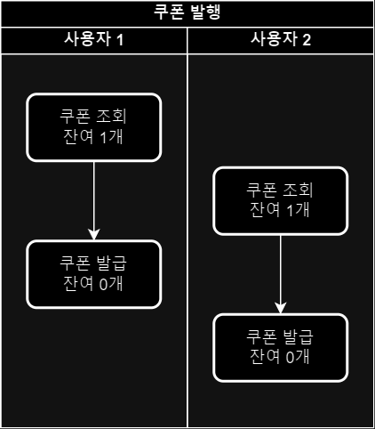
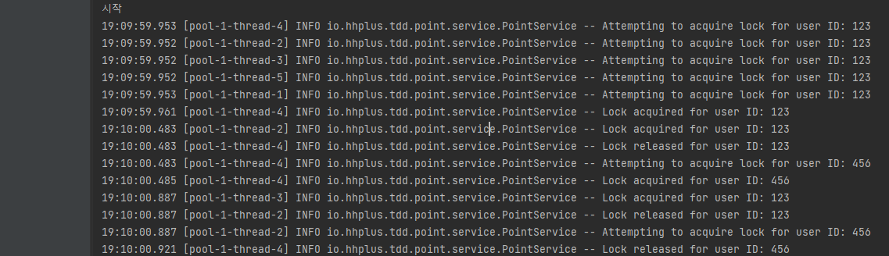

# 🌱 [향해 플러스 1주차 과제] TDD로 개발하기
> 목표: TDD(테스트 주도 개발)을 이용하여 포인트 관리 API를 구현합니다.

## 요구사항
### API End-Point
- [x] PATCH  `/point/{id}/charge` : 포인트를 충전한다.   
- [x] PATCH `/point/{id}/use` : 포인트를 사용한다.   
- [x] GET `/point/{id}` : 포인트를 조회한다.   
- [x] GET `/point/{id}/histories` : 포인트 내역을 조회한다.

### 기능 요구 사항
- 잔고가 부족할 경우, 포인트 사용은 실패하여야 합니다.
- 동시에 여러 건의 포인트 충전, 이용 요청이 들어올 경우 순차적으로 처리되어야 합니다.

### 이것부터 시작하세요!
- `/point` 패키지 (디렉토리) 내에 `PointService` 기본 기능 작성
- `/database` 패키지의 구현체는 수정하지 않고, 이를 활용해 기능을 구현
- 각 기능에 대한 단위 테스트 작성
- 총 4가지 기본 기능 (포인트 조회, 포인트 충전/사용 내역 조회, 충전, 사용) 을 구현합니다.

### STEP01 기본과제
- 포인트 충전, 사용에 대한 정책 추가 (잔고 부족, 최대 잔고 등)
- 동시에 여러 요청이 들어오더라도 순서대로 (혹은 한번에 하나의 요청씩만) 제어될 수 있도록 리팩토링
- 동시성 제어에 대한 통합 테스트 작성

### STEP02 심화과제
- 동시성 제어 방식에 대한 분석 및 보고서 작성 ( README.md )

---
## 🔒 동시성 제어 방식에 대한 분석 및 보고서

### 동시성이 제어가 왜 필요한 가요?


출처: [SDG9670 블로그](https://sdg9670.github.io/concurrency/concurrency-controll)

먼저, 쿠폰 1장 발행이 남은 서비스가 있다고 가정하자. 사용자1이 쿠폰을 조회한다. 이어서 사용자2도 쿠폰을 조회한다. 둘다 잔여 쿠폰 캣수가 1이기 때문에 발급 가능 상태여서 쿠폰 발급을 하게된다.
이 예시로 보면 분명 장여 갯수가 1개가 남은 상태라서 쿠폰 1장만 발급되어야 하는데 2개가 발급되어 데이터 무결성이 손상되었다.

>위와 같은 문제를 초례하지 않기위해서 동시성 제어가 필요하다.

---

### 그렇다면 어떤 제어 방식이 있을까?
다양한 제어 방식(DB단, Redis)이 있지만 이 과제에서 오버엔지니어링 되지 않는 선에서 선택할 수 있는 방식은 크게 2가지였다.
1. Synchronized
2. ReentrantLock

이 두 가지 키워드의 한계는 명확하다. 단일 서버에서만 유효하다.

즉, 웹서버가 단일 서버로 운영될때만 이 두 가지를 사용할 수 있고, 사용자가 많아져서 서버를 늘려야 하는 상황(Scale-Out)이 온다면, 코드를 뜯어내야하는 상황이 올 수 있다.

> 그래서 실제 개발에서는 두 가지 모두 잘 사용하지 않는다고 한다. 서버 1대일때만 유효한 코드니까.

---

### 그럼에도 불구하고 내가 선택한 것은 ReentrantLock

1. 실제 데이터베이스를 사용하는게 아니라 Application이 기동될때만 사용하기때문. 즉, Scale-Out을 고려하지 않아도 됨.
2. 근데 Synchronized도 있는데 왜 ReentrantLock 사용했어?

- 사용자별로 락 관리: **사용자마다** 별도의 락을 생성 및 관리해야 하므로, 동적 락 관리가 가능한 ReentrantLock이 적합하다.
- 공정 모드 지원: ReentrantLock은 공정 모드를 지원하여 락 경쟁에서 특정 스레드가 계속 무시되는 문제를 방지할 수 있다.
- 명시적 락 관리: ReentrantLock은 락을 명시적으로 제어할 수 있어 더 유연한 동기화 제어가 가능합니다.

>이러한 이유들때문에 최종적으로 ReentrantLock을 사용하게 됬다.
---
### 어떤 방식으로 ReentrantLock을 사용했어?
``` java
public class PointService {

    private final UserPointRepository userPointRepository;
    private final PointHistoryRepository pointHistoryRepository;
    private final Map<Long, Lock> userLocks = new ConcurrentHashMap<>();

    public UserPoint chargeUserPoint(long userId, long amount) {
        // 사용자별 Lock 가져오기 (없으면 생성)
        Lock lock = userLocks.computeIfAbsent(userId, id -> new ReentrantLock(true));

        // 다른 쓰레드가 접근 못하도록 제어
        log.info("Attempting to acquire lock for user ID: {}", userId);
        lock.lock();
        log.info("Lock acquired for user ID: {}", userId);
        try {
            // 실제 비즈니스 로직
            UserPoint userPoint = userPointRepository.findById(userId);
            UserPoint updatedUserPoint = userPoint.charge(amount);
            pointHistoryRepository.save(userId, amount, TransactionType.CHARGE, System.currentTimeMillis());
            return userPointRepository.saveOrUpdate(userId, updatedUserPoint.point());
        } catch (IllegalArgumentException e) {
            log.error("Error charging user points for user {}: {}", userId, e.getMessage());
            throw e; // 예외를 다시 던진다.
        } finally {
            lock.unlock();
            log.info("Lock released for user ID: {}", userId);
        }
    }
}
``` 
포인트를 충전할때를 생각해보자.

일단, PointService에서 userLock을 멤버변수로 생성하여 사용한다. PointService가 생성될때 같이 생성되는 것이다.

userId를 기반으로, ReentrantLock을 생성한다. 이때 true로 한 것은 공정모드(자원에 접근하려는 스레드들이 공평하게 순서를 보장받는 방식 즉, FIFO)로 진행하고 싶었기 때문이다.

해당 메서드가 실행되면 먼저 userId를 userLocks의 key로 찾고 만약 없다면, 새로 만들어서 반환된다.

이후 쓰레드가 해당 메서드가 실행될 때 lock()라는 메서드를 사용해서, 다른 쓰레드에서 같은 userId의 접근을 막는다.

예를들면, 1번 쓰레드 userId: 123의 1000원 충전요청과 2번 쓰레드 userId: 123의 2000원 충전요청이 동시에 일어났다고 해보자.
이때 1번 쓰레드가 미세한 차이로 먼저 lock.lock()이 실행된다면, 2번 쓰레드는 1번 쓰레드가 lock.unlock() 할때까지 기다려야 하는 것이다.

즉, 같은 ID가 여러번 요청을 하더라도 순차적으로 실행될 수 있는 것이다.

---

### ⚠️ 테스트 코드에서 발견한 한 가지 의문


```
19:09:59.953 [pool-1-thread-4] INFO io.hhplus.tdd.point.service.PointService -- Attempting to acquire lock for user ID: 123
19:09:59.952 [pool-1-thread-2] INFO io.hhplus.tdd.point.service.PointService -- Attempting to acquire lock for user ID: 123
19:09:59.952 [pool-1-thread-3] INFO io.hhplus.tdd.point.service.PointService -- Attempting to acquire lock for user ID: 123
19:09:59.952 [pool-1-thread-5] INFO io.hhplus.tdd.point.service.PointService -- Attempting to acquire lock for user ID: 123
19:09:59.953 [pool-1-thread-1] INFO io.hhplus.tdd.point.service.PointService -- Attempting to acquire lock for user ID: 123
19:09:59.961 [pool-1-thread-4] INFO io.hhplus.tdd.point.service.PointService -- Lock acquired for user ID: 123
19:10:00.483 [pool-1-thread-2] INFO io.hhplus.tdd.point.service.PointService -- Lock acquired for user ID: 123
19:10:00.483 [pool-1-thread-4] INFO io.hhplus.tdd.point.service.PointService -- Lock released for user ID: 123
19:10:00.483 [pool-1-thread-4] INFO io.hhplus.tdd.point.service.PointService -- Attempting to acquire lock for user ID: 456
19:10:00.485 [pool-1-thread-4] INFO io.hhplus.tdd.point.service.PointService -- Lock acquired for user ID: 456
19:10:00.887 [pool-1-thread-3] INFO io.hhplus.tdd.point.service.PointService -- Lock acquired for user ID: 123
19:10:00.887 [pool-1-thread-2] INFO io.hhplus.tdd.point.service.PointService -- Lock released for user ID: 123
19:10:00.887 [pool-1-thread-2] INFO io.hhplus.tdd.point.service.PointService -- Attempting to acquire lock for user ID: 456
``` 

제대로 개발했다면 여기서 이상한점을 발견해야한다.

자세히 보면 
pool-1-thread-4에서 첫 번째로 시도하고

19:09:59.953 [pool-1-thread-4] INFO io.hhplus.tdd.point.service.PointService -- Attempting to acquire lock for user ID: 123

userId: 123의 lock을 획득한다. 

19:09:59.961 [pool-1-thread-4] INFO io.hhplus.tdd.point.service.PointService -- Lock acquired for user ID: 123

그리고 released를 하는데 그전에 

19:10:00.483 [pool-1-thread-2] INFO io.hhplus.tdd.point.service.PointService -- Lock acquired for user ID: 123

2번 쓰레드에서 획득했다는 로그가 잡힌다. 이것은 대체 무엇일까...?

아까 말한 것을 토대로 이야기 하자면, unlock이 되고 락을 획득해야하는데 뭔가 잘못되어 버린것일까...?

> 답을 말하자면, 단순 로그의 시간차이이며, 문제가 아니다.

``` java
lock.unlock();
log.info("Lock released for user ID: {}", userId);
```

여기서 unlock()이 되자마자 바로 기다리던 2번 쓰레드가 lock을 획득해버린 것이다.
그리고 그밑에

log.info("Lock released for user ID: {}", userId);

이 실행되어서 로그가 그렇게 보인것이지, 실제 로직상에서는 4번 쓰레드가 unlock을 외치고 2번 쓰레드가 lock을 획득 한 것이 맞다.

 
### 결론(배운점)
1. 테스트코드 작성법
2. 동시성 제어는 왜 필요한 것이며, 어떤 방식으로 제어할 수 있는가

이 두 가지를 조금씩 알아 갈 수 있는 과제였다고 생각한다.